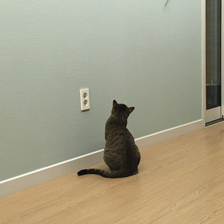

# HODU Landing Page

고양이 테마의 반응형 랜딩 페이지입니다. 웹 접근성을 고려한 시맨틱 HTML과 모던 CSS를 활용하여 구현했습니다.

## 목차

- [프로젝트 소개](#프로젝트-소개)
- [주요 기능](#주요-기능)
- [기술 스택](#기술-스택)
- [프로젝트 구조](#프로젝트-구조)
- [개발 일정](#개발-일정)
- [화면 설계도](#화면-설계도)
- [구현 화면 및 기능](#구현-화면-및-기능)
- [실행 방법](#실행-방법)
- [주요 구현 사항](#주요-구현-사항)
- [웹 접근성 고려사항](#웹-접근성-고려사항)
- [반응형 디자인](#반응형-디자인)
- [에러와 에러 해결](#에러와-에러-해결)
- [개발하며 느낀점](#개발하며-느낀점)
- [참고자료](#참고자료)

## 프로젝트 소개

HODU는 고양이 테마의 랜딩 페이지로, 사용자 친화적인 인터페이스와 웹 접근성을 중점으로 개발했습니다. 반응형 디자인을 통해 다양한 디바이스에서 최적의 사용자 경험을 제공합니다.

## 주요 기능

- **반응형 디자인**: 데스크톱, 태블릿, 모바일 환경 지원
- **모달 시스템**: 구독 폼 및 모바일 메뉴 모달
- **웹 접근성**: 스크린 리더 지원 및 키보드 네비게이션
- **스무스 스크롤**: 부드러운 페이지 내 이동
- **고정 헤더**: 스크롤 시에도 항상 접근 가능한 네비게이션

## 기술 스택

- **HTML**: 시맨틱 마크업
- **CSS**:
  - CSS Grid & Flexbox
  - CSS Custom Properties (변수)
  - Media Queries
  - clamp() 함수
- **JavaScript**:
  - DOM 조작
  - 이벤트 리스너
  - 모달 기능
- **명명법**: 케밥 케이스 (kebab-case) - 단어 사이를 하이픈(-)으로 연결하여 가독성을 높이고 일관성 있는 클래스명 사용

## 📁 프로젝트 구조

```
2025-project-hodu-landing-page/
├── fonts/
│   ├── SpoqaHanSansNeo-Bold.otf
│   ├── SpoqaHanSansNeo-Light.otf
│   ├── SpoqaHanSansNeo-Medium.otf
│   ├── SpoqaHanSansNeo-Regular.otf
│   └── SpoqaHanSansNeo-Thin.otf
├── images/
│   ├── box-cat.png
│   ├── footer-icon-group.png
│   ├── icon-blog.png
│   ├── icon-facebook.png
│   ├── icon-insta.png
│   ├── icon-youtube.png
│   ├── img_1.png ~ img_5.png
│   ├── Logo-fin.svg
│   ├── mail.svg
│   ├── menu-tab.png
│   ├── mobile-modal.png
│   ├── modal.png
│   ├── scroll-top-btn.png
│   └── scroll-top-btn-hover.png
├── js/
│   └── modal.js
├── styles/
│   ├── mobile.css
│   ├── reset.css
│   └── style.css
└── index.html
```

## 📅 개발 일정

### 1단계: 기획 및 설계 (1일차)

- [x] 시멘틱 태그를 활용한 HTML 기본 구조 작성(header, main, section, footer 등)
- [x] 헤더 영역 마크업 및 스타일링
- [x] 메인 콘텐츠 영역 레이아웃 구성
- [x] 푸터 영역 마크업 및 스타일링
- [x] 데스크톱 화면 기준 레이아웃 완성

### 2단계: HTML 구조 작성 (2일차)

- [x] clamp() 함수를 활용한 데스크톱 화면 반응형 적용
- [x] 웹 접근성 속성 추가
- [x] 미디어 쿼리를 활용한 모바일 레이아웃 구현

### 3단계: CSS 스타일링, JavaScript 기능 구현 (3일차)

- [x] 미디어 쿼리 브레이크포인트 정의 및 점검
- [x] 갤러리 슬라이더 구현
- [x] 모달창 HTML 구조 작성
- [x] 모달창 CSS 스타일링(숨김 처리 포함)
- [x] 모달 기능 구현

### 4단계: 최종 정리 및 점검 (4일차)

- [x] 적절한 대체 텍스트(alt) 제공
- [x] 키보드 접근성 확인
- [x] CSS 최적화 (중복 코드 제거 등)
- [x] 코드 주석 추가 및 정리
- [x] 모바일/데스크톱 환경에서 최종 테스트
- [x] 웹 성능 최적화 (이미지 최적화, 불필요한 코드 제거 등)
- [x] 시맨틱 태그 활용 검증

## 와이어프레임 / UI

### 데스크톱 | 모바일 버전


## 구현 화면 및 기능

### 데스크톱 버전


### 모바일 버전


**구현된 주요 기능:**

- 반응형 레이아웃 (데스크톱 ↔ 모바일 전환)
- 구독 모달 시스템
- 모바일 메뉴 모달
- 스무스 스크롤 네비게이션
- 웹 접근성 지원 (키보드 네비게이션, 스크린 리더)

## 실행 방법

1. 프로젝트 클론

```bash
git clone https://github.com/chaehyeon119/2025-project-hodu-landing-page.git
cd 2025-project-hodu-landing-page
```

## 🌐 배포 링크

- **GitHub Pages**: [https://chaehyeon119.github.io/2025-project-hodu-landing-page/](https://chaehyeon119.github.io/2025-project-hodu-landing-page/)

## 주요 구현 사항

### 1. CSS Custom Properties 활용

```css
:root {
  --orange: #d97652;
  --white: #fff;
  --subscribe-navy: #263140;
  --header-bg: #f2e9d8;
  --font-main: "Spoqa Han Sans Neo", sans-serif;
  --placeholder-gray: #767676;
}
```

### 2. 반응형 폰트 크기 (clamp 함수)

```css
/* 폰트가 넘치는 문제를 해결해줌 */
font-size: clamp(1.4rem, 2.5vw, 1.8rem);
```

### 3. 모달 시스템

```javascript
// 구독 모달 열기/닫기
openSubscribeModalBtn.addEventListener("click", () => {
  myModal.style.display = "block";
});

// 바깥 클릭으로 모달 닫기
myModal.addEventListener("click", (e) => {
  if (e.target === myModal) myModal.style.display = "none";
});
```

### 4. 스무스 스크롤

```css
html {
  scroll-behavior: smooth;
}
```

## 웹 접근성 고려사항

### 1. 시맨틱 HTML 구조

- `<header>`, `<main>`, `<footer>` 태그 활용
- `<nav>`, `<section>`, `<article>` 등 의미있는 태그 사용

### 2. 스크린 리더 지원

- `aria-labelledby`, `aria-describedby` 속성으로 연결

```html
<!-- 스크린 리더 전용 설명 -->
<p id="subscribe-help" class="a11y-hidden">
  메일레터는 매주 월요일에 발송되며, 언제든 구독을 해지할 수 있습니다.
</p>

<!-- 접근성 숨김 클래스 -->
.a11y-hidden { position: absolute; width: 1px; height: 1px; padding: 0; margin:
-1px; overflow: hidden; clip: rect(0, 0, 0, 0); white-space: nowrap; border: 0;
}
```

### 3. 이미지 대체 텍스트

```html
<!-- 갤러리 이미지들 - 구체적인 설명 -->




<!-- 장식용 이미지 - 빈 alt 속성 -->

```

## 반응형 디자인

### 1. 데스크톱 우선 접근법

- 기본 스타일은 데스크톱 기준
- `@media screen and (min-width: 576px)` 로 모바일 스타일 적용

### 2. 유연한 레이아웃

```css
/* max-width와 width:100% 속성의 중요성 */
.container {
  max-width: 1280px;
  width: 100%;
  margin-inline: auto;
  padding: 0 clamp(16px, 4vw, 32px);
}
```

### 3. 반응형 간격

```css
/* clamp를 활용한 반응형 간격 */
gap: clamp(12px, 3vw, 40px);
padding: clamp(12px, 2.2vw, 32px) clamp(16px, 4vw, 32px);
```

## 에러와 에러 해결

### 1. CSS 관련 에러

#### 문제: 폰트 크기가 화면 크기에 따라 넘치는 현상

**에러 상황**: 모바일에서 텍스트가 컨테이너를 벗어나는 문제
**해결 방법**: `clamp()` 함수를 사용하여 반응형 폰트 크기 설정

```css
/* 기존 코드 */
font-size: 1.8rem;

/* 해결된 코드 */
font-size: clamp(1.4rem, 2.5vw, 1.8rem);
```

#### 문제: 컨테이너가 화면 너비를 초과하는 현상

**에러 상황**: `max-width`만 설정하고 `width: 100%`를 누락
**해결 방법**: 두 속성을 함께 사용하여 반응형 컨테이너 구현

```css
/* 기존 코드 */
.container {
  max-width: 1280px;
  margin: 0 auto;
}

/* 해결된 코드 */
.container {
  max-width: 1280px;
  width: 100%;
  margin-inline: auto;
  padding: 0 clamp(16px, 4vw, 32px);
}
```

#### 문제: 화면 전체에 스크롤이 생긴 현상

**에러 상황**:
모바일 환경에서 이미지 슬라이더 구현 시 전체 화면에 가로 스크롤이 발생하여 오른쪽 여백이 생기는 문제

**해결 방법**:
슬라이더를 감싸는 컨테이너에 `width: 100%` 설정

```css
/* 기존 코드 (문제 발생) */
.gallery-container {
  max-width: 1280px;
  margin: 0 auto;
  /* width 속성 누락으로 인한 오버플로우 */
}

/* 해결된 코드 */
.gallery-container {
  max-width: 1280px;
  width: 100%; /* 컨테이너가 화면 너비를 초과하지 않도록 설정 */
  margin: 0 auto;
  overflow: hidden; /* 추가로 슬라이더 오버플로우 방지 */
}
```

### 2. JavaScript 관련 에러

#### 문제: ID 매핑 불일치로 인한 모달 기능 작동 안됨

**에러 상황**:
JavaScript에서 참조하는 ID와 HTML의 실제 ID가 일치하지 않아 모달 열기/닫기 기능이 작동하지 않음

**해결 방법**:
HTML과 JavaScript의 ID를 정확히 매핑

```javascript
// 해결된 코드 (정확한 ID 매핑)
const openSubscribeModalBtn = document.getElementById("openModalBtn"); // HTML의 실제 ID
const closeSubscribeModalBtn = document.getElementById("closeModalBtn"); // HTML의 실제 ID
const myModal = document.getElementById("myModal"); // HTML의 실제 ID
```

### 3. 웹 접근성 관련 에러

#### 문제: 적절하지 않은 alt 속성 사용

**에러 상황**:
장식용 이미지에 불필요한 alt 텍스트 제공

**해결 방법**:
장식용 이미지는 `alt=""` 또는 `aria-hidden="true"` 사용

```html
<!-- 기존 코드 -->


<!-- 해결된 코드 -->

```

### 4. 반응형 디자인 관련 에러

#### 문제: 모바일에서 레이아웃이 깨지는 현상

**에러 상황**:
고정된 픽셀 값 사용으로 인한 반응형 문제

**해결 방법**:
상대 단위와 clamp() 함수 활용

```css
/* 기존 코드 */
gap: 30px;
padding: 32px;

/* 해결된 코드 */
gap: clamp(12px, 3vw, 40px);
padding: clamp(12px, 2.2vw, 32px) clamp(16px, 4vw, 32px);
```

## 개발하며 느낀점

### 1. CSS 선택자 우선순위의 중요성

- 명확한 선택자 구조로 스타일 충돌 방지
- CSS Custom Properties로 일관성 있는 디자인 시스템 구축

### 2. 반응형 디자인의 핵심

- `clamp()` 함수로 폰트 크기 반응형 처리
- `max-width`와 `width: 100%` 조합으로 컨테이너 반응형 구현
- `line-height`로 높이를 맞추는 것의 장점

### 3. 웹 접근성의 실무적 적용

- 시맨틱 HTML의 중요성 재확인
- 스크린 리더 사용자를 위한 적절한 대체 텍스트 제공

### 4. 성능 최적화

- 이미지 최적화 및 적절한 포맷 선택
- CSS와 JavaScript 파일 분리로 유지보수성 향상

### 5. 코드 리뷰의 중요성

- 단순한 오류 검출을 넘어서 클린 코드 작성과 코드 품질 향상에 큰 도움을 받음
- 타인의 관점에서 발견할 수 있는 문제점과 개선사항을 학습할 수 있음#### 폰트 파일 폴더 정리의 이점

**피드백 적용 사례**:
`fonts/` 폴더를 생성하면 성능 최적화 및 더욱 체계적 관리 가능

**로컬 폰트 사용의 성능적 장점:**

- **파일 관리 용이성**: 폰트 파일들을 한 곳에 모아서 관리
- **경로 일관성**: `../fonts/` 상대 경로로 모든 폰트 파일 접근
- **버전 관리 효율성**: 폰트 파일 변경 시 Git에서 변경사항 추적 용이
- **성능 최적화**: 필요한 폰트만 선택적으로 로드 가능
- **빠른 로딩 속도**: 외부 서버 요청 없이 직접 제공
- **안정적인 서비스**: 외부 서버 장애에 영향받지 않음
- **오프라인 지원**: 인터넷 연결 없이도 폰트 정상 표시
- **폰트 가중치 체계화**: Bold, Regular, Medium, Light, Thin 등 체계적 관리

```css
/* 폰트 정의 - 상대 경로로 깔끔하게 관리 */
@font-face {
  font-family: "Spoqa Han Sans Neo";
  src: url("../fonts/SpoqaHanSansNeo-Bold.otf") format("otf");
  font-weight: 700;
  font-style: normal;
}

@font-face {
  font-family: "Spoqa Han Sans Neo";
  src: url("../fonts/SpoqaHanSansNeo-Regular.otf") format("otf");
  font-weight: 400;
  font-style: normal;
}
```

## 참고자료

- [MDN Web Docs - WAI-ARIA Roles](https://developer.mozilla.org/en-US/docs/Web/Accessibility/ARIA/Reference/Roles)
- [인프런] 아는 만큼 보이는 웹 접근성 WCAG

## 🔗 링크

- **GitHub Repository**: [https://github.com/chaehyeon119/2025-project-hodu-landing-page](https://github.com/chaehyeon119/2025-project-hodu-landing-page)
- **Live Demo**: [https://chaehyeon119.github.io/2025-project-hodu-landing-page/](https://chaehyeon119.github.io/2025-project-hodu-landing-page/)

---

**참고**: 본 프로젝트는 [모두의연구소/위니브] 프론트엔드 스쿨 HTML/CSS 프로젝트 목적으로 제작되었습니다.

**개발자**: 김채현  
**기술 스택**: HTML, CSS, JavaScript
